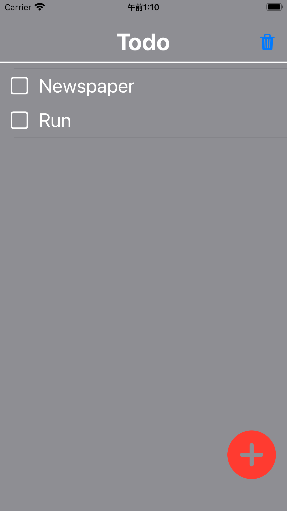

 

# simple-to-do
- [App Store](https://apps.apple.com/us/app/simple-todo-app/id1619527885)

## Main Screen

https://user-images.githubusercontent.com/52474650/163609042-61840636-a13f-4efa-b385-15ad920b3038.mp4

## Others
[Documents](https://kokoichi206.github.io/simple-to-do/)

## License
"simple-to-do" is under [MIT License](LICENSE).
